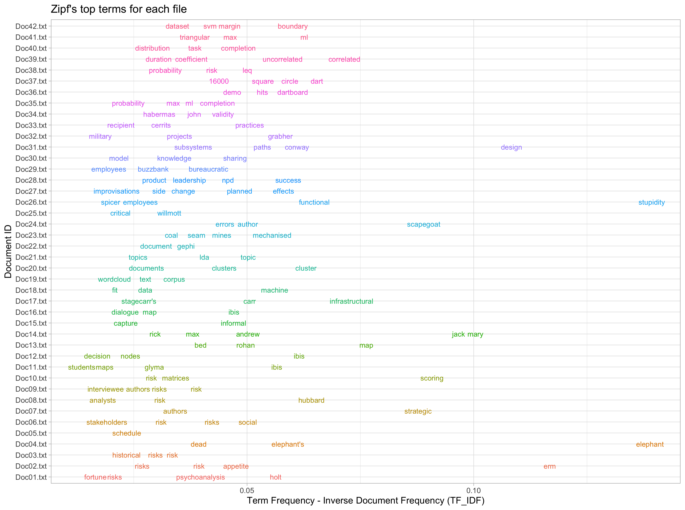
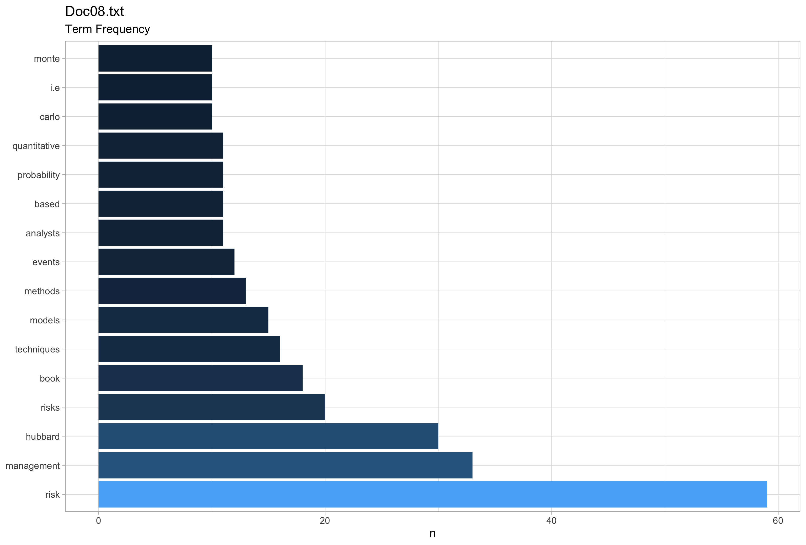
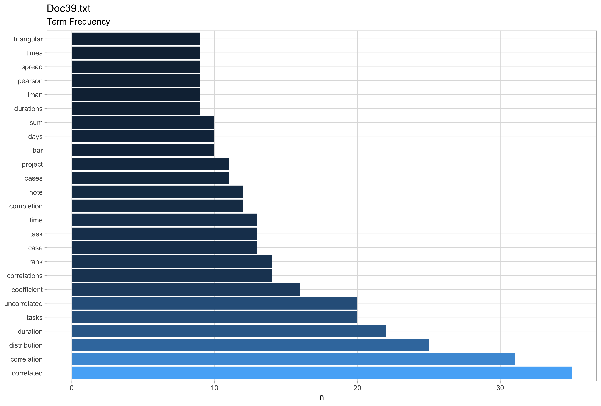

## Business Understanding

A series of *random* files have been found in a folder on a personal computer, these files are unhelpfully named, 01.txt - 42.txt files. They are of varying lengths, the relative importance of each file isn't known. To go through the files is both time consuming and arduous - it could be a trip down memory lane to rediscover some old work but time poor folks don't want to *waste* time doing this. Ideally these files would all be grouped into similar topics where appropriate and filed under these topics, maybe even renamed with key terms to make future referencing simple.   

### Objectives and Assessment of the Situation

The situation isn't dire, there isn't any time pressure on and given that these files have not been directly searched for implies this will be a house keeping activity. The final outcome sought wil be a series of folders with topic titles and in these folders a set of named documents that will be more readily searchable for future referencing.

### Data Mining Goals and Project Plan

The Data has been given in a single folder named **Data**. There is no requirement to search for more data beyond this file. The broad plan is to conduct a text analysis on the files to determine some broad topics that these files can be grouped into.

## Data Understanding

The **Data** folder consisted of 42 separate text files (.txt).

### Describe

The summary table below offers an initial indication of the numbers of words and sentences in each of the files.  

| Item      | Minimum | Mean | Maximum |
|:--------- |:------- | ---- | ------- |
| Words     | 508     | 2235 | 5785    |
| Sentences | 32      | 100  | 263     |

Table: Word and Sentence counts for the files[^e1f3]

### Exploratory Analysis

Below is a *wordcloud* that highlights the most used terms across all of the files.

In addition to this wordcloud Annex A has a complete list of the files with the top 5 terms used for each file.

Another way to start to consider the importance of each word in the files is to use apply Zipf's law to the corpus of documents. Below is a broad list of the terms that are considered important to each of the files and the relative importance according to Zipf's Law. [^0432]

This was done in addition to producing a graph for each of files that highlighted the most frequent terms in each file. Two examples are below.
:::::
:::
{width=80%}
:::

:::
{width=80%}
:::
:::::

The decision was then made to better understand the word interactions by assessing bigrams and trigrams.

## Data Preparation

### Selection of Data

### Clean and Construct Data

### Integrate and Format Data

## Modeling

### Selection of the Modelling Technique

### Build Model

### Assessment of the Model

## Evaluation

### Evaluate the Results

### Next Steps

## Deployment

### Plan Deployment

### Review

\newpage

# Annex A
Table: Document with the counts of the top 5 words used in each document

:::::::::: {.columns}

| doc_id    | word            |   n |
|:--------- |:--------------- | ---:|
| Doc01.txt | risk            |  52 |
| Doc01.txt | management      |  28 |
| Doc01.txt | risks           |  20 |
| Doc01.txt | holt            |  17 |
| Doc01.txt | problem         |  16 |
| Doc02.txt | risk            |  51 |
| Doc02.txt | erm             |  30 |
| Doc02.txt | management      |  22 |
| Doc02.txt | risks           |  22 |
| Doc02.txt | process         |  20 |
| Doc03.txt | risk            |  16 |
| Doc03.txt | data            |   9 |
| Doc03.txt | project         |   9 |
| Doc03.txt | risks           |   9 |
| Doc03.txt | post            |   7 |
| Doc04.txt | elephant        |  10 |
| Doc04.txt | risk            |  10 |
| Doc04.txt | risks           |   6 |
| Doc04.txt | project         |   4 |
| Doc04.txt | situation       |   4 |
| Doc05.txt | project         |  61 |
| Doc05.txt | projects        |  11 |
| Doc05.txt | management      |  10 |
| Doc05.txt | managers        |  10 |
| Doc05.txt | risks           |   9 |
| Doc05.txt | time            |   9 |
| Doc06.txt | project         |  39 |
| Doc06.txt | risk            |  36 |
| Doc06.txt | risks           |  31 |
| Doc06.txt | social          |  28 |
| Doc06.txt | management      |  16 |
| Doc07.txt | risks           |  27 |
| Doc07.txt | project         |  23 |
| Doc07.txt | strategic       |  20 |
| Doc07.txt | risk            |  13 |
| Doc07.txt | authors         |   9 |
| Doc08.txt | risk            |  59 |
| Doc08.txt | management      |  33 |
| Doc08.txt | hubbard         |  30 |
| Doc08.txt | risks           |  20 |
| Doc08.txt | book            |  18 |
| Doc09.txt | risk            |  52 |
| Doc09.txt | project         |  44 |
| Doc09.txt | management      |  39 |
| Doc09.txt | risks           |  26 |
| Doc09.txt | authors         |  18 |
| Doc09.txt | projects        |  18 |
| Doc10.txt | scoring         |  23 |
| Doc10.txt | risk            |  21 |
| Doc10.txt | methods         |  15 |
| Doc10.txt | techniques      |  10 |
| Doc10.txt | risks           |   9 |
| Doc11.txt | ibis            |  69 |
| Doc11.txt | issues          |  19 |
| Doc11.txt | knowledge       |  18 |
| Doc11.txt | context         |  17 |
| Doc11.txt | map             |  17 |
| Doc12.txt | ibis            |  26 |
| Doc12.txt | decision        |  15 |
| Doc12.txt | mapping         |  10 |
| Doc12.txt | issue           |   9 |
| Doc12.txt | making          |   8 |
| Doc12.txt | nodes           |   8 |
| Doc13.txt | map             |  20 |
| Doc13.txt | asked           |  10 |
| Doc13.txt | good            |   8 |
| Doc13.txt | point           |   8 |
| Doc13.txt | points          |   8 |
| Doc13.txt | question        |   8 |
| Doc14.txt | jack            |  30 |
| Doc14.txt | mary            |  22 |
| Doc14.txt | max             |  16 |
| Doc14.txt | looked          |  12 |
| Doc14.txt | map             |  12 |
| Doc15.txt | knowledge       |  44 |
| Doc15.txt | informal        |  16 |
| Doc15.txt | project         |  16 |
| Doc15.txt | process         |  14 |
| Doc15.txt | capture         |  10 |
| Doc16.txt | ibis            |  20 |
| Doc16.txt | map             |  14 |
| Doc16.txt | dialogue        |  13 |
| Doc16.txt | mapping         |  12 |
| Doc16.txt | discussion      |  10 |
| Doc16.txt | elements        |  10 |
| Doc17.txt | map             |  23 |
| Doc17.txt | issue           |  22 |
| Doc17.txt | article         |  14 |
| Doc17.txt | point           |  14 |
| Doc17.txt | infrastructural |  13 |
| Doc18.txt | data            |  41 |
| Doc18.txt | learning        |  22 |
| Doc18.txt | model           |  22 |
| Doc18.txt | machine         |  19 |
| Doc18.txt | fit             |  12 |
| Doc18.txt | function        |  12 |
| Doc19.txt | corpus          |  39 |
| Doc19.txt | text            |  35 |
| Doc19.txt | terms           |  28 |
| Doc19.txt | words           |  28 |
| Doc19.txt | term            |  23 |
| Doc20.txt | cluster         |  49 |
| Doc20.txt | clustering      |  36 |
| Doc20.txt | documents       |  33 |
| Doc20.txt | clusters        |  22 |
| Doc20.txt | algorithm       |  21 |
| Doc20.txt | algorithms      |  21 |
| Doc20.txt | distance        |  21 |
| Doc21.txt | topic           |  58 |
| Doc21.txt | document        |  25 |
| Doc21.txt | topics          |  24 |
| Doc21.txt | documents       |  20 |
| Doc21.txt | lda             |  18 |
| Doc21.txt | tm_map          |  18 |
| Doc22.txt | document        |  32 |
| Doc22.txt | documents       |  27 |
| Doc22.txt | graph           |  21 |
| Doc22.txt | similarity      |  21 |
| Doc22.txt | matrix          |  19 |
| Doc23.txt | work            |  22 |
| Doc23.txt | group           |  10 |
| Doc23.txt | mechanised      |  10 |
| Doc23.txt | mines           |   8 |
| Doc23.txt | productivity    |   7 |
| Doc23.txt | seam            |   7 |
| Doc23.txt | shifts          |   7 |
| Doc24.txt | approach        |  17 |
| Doc24.txt | error           |  16 |
| Doc24.txt | errors          |  16 |
| Doc24.txt | scapegoat       |  13 |
| Doc24.txt | system          |  13 |
| Doc25.txt | management      |  26 |
| Doc25.txt | critical        |  14 |
| Doc25.txt | employees       |  12 |
| Doc25.txt | alvesson        |   9 |
| Doc25.txt | organisation    |   9 |
| Doc26.txt | stupidity       |  35 |
| Doc26.txt | functional      |  20 |
| Doc26.txt | employees       |  15 |
| Doc26.txt | organisations   |  15 |
| Doc26.txt | organisation    |  13 |
| Doc27.txt | change          |  28 |
| Doc27.txt | effects         |  21 |
| Doc27.txt | planned         |  16 |
| Doc27.txt | side            |  15 |
| Doc27.txt | organisations   |   8 |
| Doc28.txt | success         |  18 |
| Doc28.txt | project         |  14 |
| Doc28.txt | culture         |  11 |
| Doc28.txt | projects        |  10 |
| Doc28.txt | management      |   9 |
| Doc28.txt | organisational  |   9 |
| Doc28.txt | product         |   9 |
| Doc28.txt | variables       |   9 |
| Doc28.txt | work            |   9 |
| Doc29.txt | management      |  60 |
| Doc29.txt | project         |  44 |
| Doc29.txt | work            |  37 |
| Doc29.txt | bureaucratic    |  27 |
| Doc29.txt | post            |  19 |
| Doc30.txt | knowledge       |  63 |
| Doc30.txt | model           |  29 |
| Doc30.txt | project         |  25 |
| Doc30.txt | creation        |  20 |
| Doc30.txt | process         |  20 |
| Doc30.txt | sharing         |  20 |
| Doc31.txt | design          |  37 |
| Doc31.txt | system          |  17 |
| Doc31.txt | communication   |  14 |
| Doc31.txt | team            |  10 |
| Doc31.txt | organisation    |   9 |
| Doc32.txt | projects        |  46 |
| Doc32.txt | project         |  35 |
| Doc32.txt | grabher         |  13 |
| Doc32.txt | organisations   |  12 |
| Doc32.txt | organizational  |  12 |
| Doc33.txt | practices       |  34 |
| Doc33.txt | practice        |  19 |
| Doc33.txt | problems        |  15 |
| Doc33.txt | organisations   |  12 |
| Doc33.txt | book            |   9 |
| Doc33.txt | organizational  |   9 |
| Doc34.txt | claims          |  19 |
| Doc34.txt | validity        |  17 |
| Doc34.txt | john            |  13 |
| Doc34.txt | project         |  12 |
| Doc34.txt | dialogue        |  11 |
| Doc35.txt | days            |  50 |
| Doc35.txt | completion      |  49 |
| Doc35.txt | task            |  49 |
| Doc35.txt | time            |  48 |
| Doc35.txt | times           |  42 |
| Doc36.txt | centre          |  10 |
| Doc36.txt | distribution    |  10 |
| Doc36.txt | standard        |  10 |
| Doc36.txt | dartboard       |   9 |
| Doc36.txt | deviation       |   8 |
| Doc36.txt | hit             |   8 |
| Doc36.txt | hits            |   8 |
| Doc36.txt | simulation      |   8 |
| Doc36.txt | theta           |   8 |
| Doc37.txt | dart            |  11 |
| Doc37.txt | probability     |  11 |
| Doc37.txt | result          |  11 |
| Doc37.txt | circle          |  10 |
| Doc37.txt | number          |   9 |
| Doc37.txt | square          |   9 |
| Doc38.txt | risk            |  48 |
| Doc38.txt | task            |  27 |
| Doc38.txt | probability     |  23 |
| Doc38.txt | time            |  22 |
| Doc38.txt | leq             |  16 |
| Doc39.txt | correlated      |  35 |
| Doc39.txt | correlation     |  31 |
| Doc39.txt | distribution    |  25 |
| Doc39.txt | duration        |  22 |
| Doc39.txt | tasks           |  20 |
| Doc39.txt | uncorrelated    |  20 |
| Doc40.txt | task            |  55 |
| Doc40.txt | time            |  53 |
| Doc40.txt | tasks           |  46 |
| Doc40.txt | completion      |  37 |
| Doc40.txt | distribution    |  28 |
| Doc41.txt | distribution    |  31 |
| Doc41.txt | ml              |  28 |
| Doc41.txt | simulation      |  28 |
| Doc41.txt | max             |  25 |
| Doc41.txt | probability     |  25 |
| Doc42.txt | boundary        |  59 |
| Doc42.txt | plot            |  52 |
| Doc42.txt | decision        |  43 |
| Doc42.txt | data            |  37 |
| Doc42.txt | dataset         |  34 |

# References

[^e1f3]: This is inclusive of numbers and special characters for an initial assessment. Sentences have been assessed in accordance with unicode sentence boundaries. @UAX29Unicode

[^0432]: Zipf's is an imperical law stating that word frequency in documents is inversely proportional to work rank in descending order of occurrence. @PDFZipfLaw
