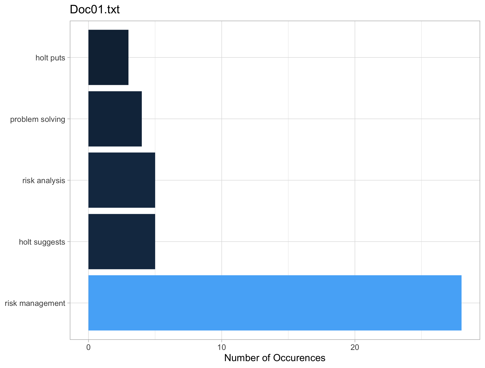
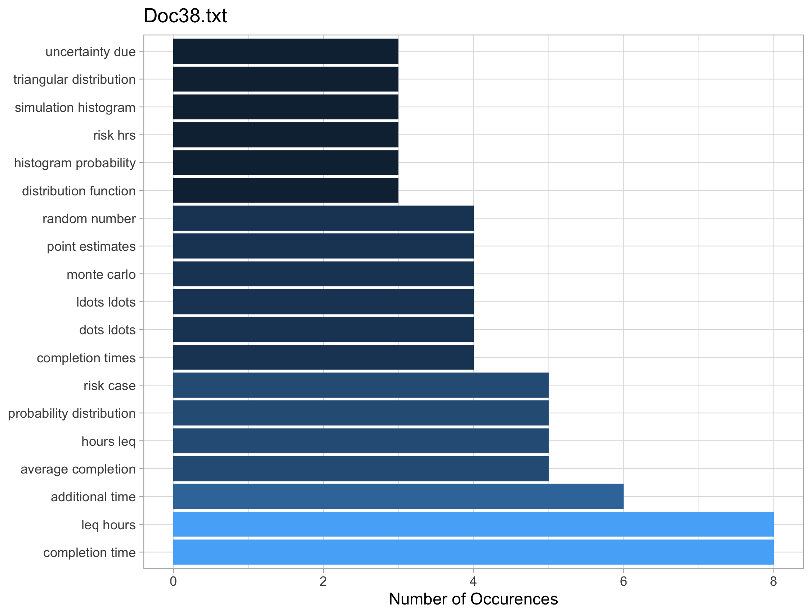
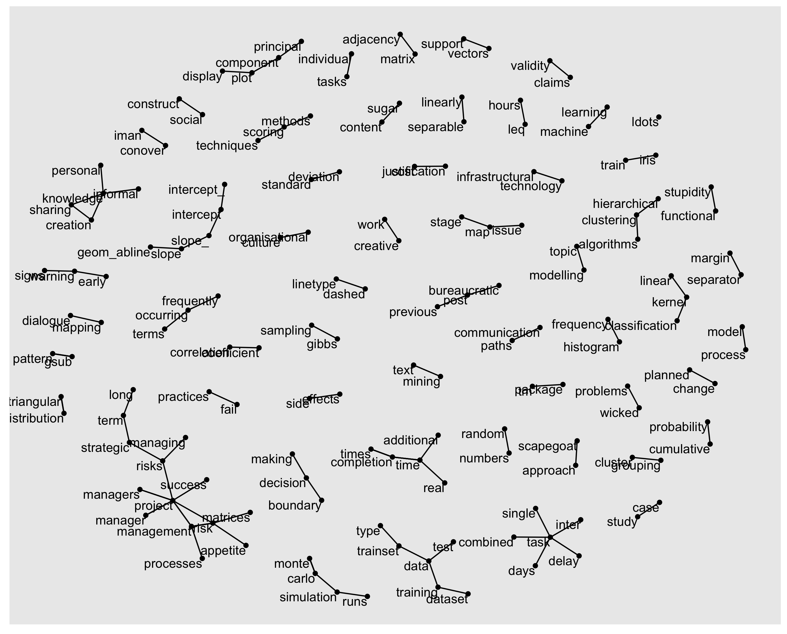
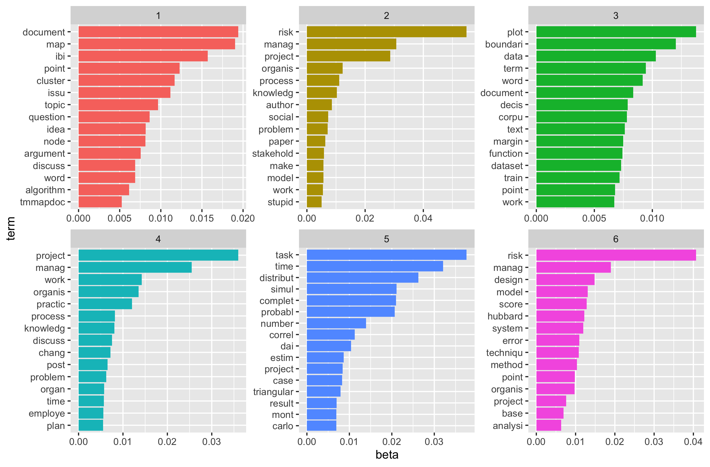
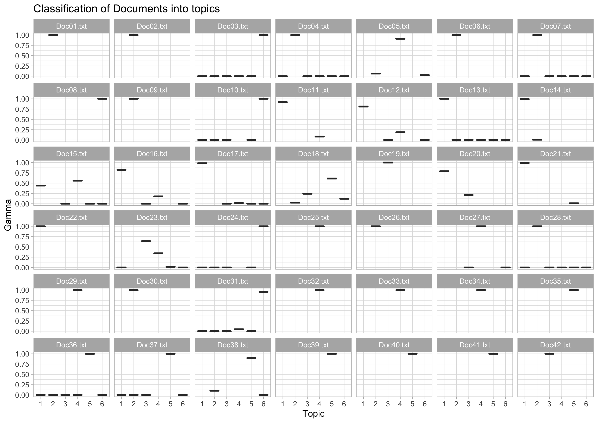

## Business Understanding

A series of *random* files have been found in a folder on a personal computer, these files are unhelpfully named, 01.txt - 42.txt files. They are of varying lengths, the relative importance of each file isn't known. To go through the files is both time consuming and arduous - it could be a trip down memory lane to rediscover some old work but time poor folks don't want to *waste* time doing this. Ideally these files would all be grouped into similar topics where appropriate and filed under these topics, maybe even renamed with key terms to make future referencing simple.   

### Objectives and Assessment of the Situation

The situation isn't dire, there isn't any time pressure on and given that these files have not been directly searched for implies this will be a house keeping activity. The final outcome sought wil be a series of folders with topic titles and in these folders a set of named documents that will be more readily searchable for future referencing.

### Data Mining Goals and Project Plan

The Data has been given in a single folder named **Files**. There is no requirement to search for more data beyond this file. The broad plan is to conduct a text analysis on the files to determine some broad topics that these files can be grouped into. The data is a folder with 42 separate text files (.txt) in it.

### Describe the Data

The summary table below offers an initial indication of the numbers of words and sentences in each of the files.  

| Item      | Minimum | Mean | Maximum |
|:--------- |:------- | ---- | ------- |
| Words     | 508     | 2235 | 5785    |
| Sentences | 32      | 100  | 263     |

Table: Word and Sentence counts for the files[^e1f3]

\newpage
### Exploratory Analysis

Below is a *wordcloud* that highlights the most used terms across all of the files.

{width=60%}

In addition to the *wordcloud* a list most frequently occurring words for each file was developed, an example of the tables generated is below:

Table: Most frequently occurring words in file 39

|word         |  n|
|:------------|--:|
|correlated   | 35|
|correlation  | 31|
|distribution | 25|
|duration     | 22|
|tasks        | 20|
|uncorrelated | 20|

Table: Most Frequently occurring terms in file 29

|word         |  n|
|:------------|--:|
|management   | 60|
|project      | 44|
|work         | 37|
|bureaucratic | 27|
|post         | 19|

A table was generated for each file which offers insight into the contents of the files.

Another way to start to consider the importance of each word in the files is to use apply Zipf's law to the corpus of documents. Below is a broad list of the terms that are considered important to each of the files and the relative importance according to Zipf's Law. [^0432]

{width=100%}

This was done in addition to producing a graph for each of files that highlighted the most frequent terms in each file. Two examples are below.

{width=90%}

{width=90%}

In order to get a better understanding of the contents of the files the files were broken into N-grams or groupings of words that are used together in the documents. This offers a way to gain greater insight by understanding which words appear together or which words appear in the same document generally.[@RelationshipsWordsNgrams] Example results for two of the files are below.

From visual analysis we can see that this is more informative but we still don't have a really good feel for how many different possible topics there are across all of the files or what reasonable groupings for the documents could be. considering the terms closely it is evident that some more cleaning of the text corpus is required. This will be addressed as part of the steps before unsupervised modelling is conducted.

\newpage

The relationships across all of the documents were mapped visually in an effort to better understand groupings of the different terms across all of the files. This relationship diagram is below.

Based on this gross check we can see a few key terms that are starting to group together - this can assist in informing the number of topics as part of future modelling activities.

The file preparation to this point has consisted of the removal of digits and a series of stopwords. Some extra *stop words* were added to the list based on initial analysis. Characters like '_t' were removed from the files.

\newpage
## Modeling

Prior to conducting unsupervised topic modelling using the *Latent Dirichlet Allocation* [^8d01] all punctuation was removed in addition to *stemming*[^56ac] of the Data. This comes with some risk as some of the sentiment can be lost as part of the process - it helps to reduce the feature space as part of larger data sets - it was done here to determine if there are any benefits in narrowing the topics.

The results of the topics modelling are below.

The choice to make six topics as part of the process was after a series of trials - this number was assessed as offering the best balance between meaningful groups and the size of the groups being useful. There is still some overlap between the terms and the topics but it is likely this will be a product of the content in the files themselves.

In order to assess how the model went at classifying the documents into different groups the facet chart below was created. This offers a visual way to view which documents should be grouped into which topic and how confident we are of the grouping.

It appears that of the 42 files only a couple of files couldn't be conclusively placed into a topic. These files are 15, 18 and 23. After reviewing these files there is some overlap across topics and the terms used in these files with other topics. File 15 should be grouped into topic 4, file 8 should be grouped into topic 5. File 23 was one of the harder to group. The model had it sitting in topic 5 but this doesn't seem suitable - this file will require further review before settling on a topic as it appears to span multiple topics equally and none of them conclusively. As per Figure 2 above we can see that the key terms in the document are *coal, seam, mines, mechanised* which tends to indicate a unique set of terms according to Zipf's law relative to other documents. 

## Evaluation

The analysis conducted on the *mystery* files has revealed 6 different topics according to LDA analysis. LDA was conducted with both *stemming* and without it - the results of the model that was preprocessed with *stemming* were marginally better offering a few more files that could be conclusively grouped.

## Next Steps

Following this analysis the way forward would be to create 6 different files using terms from the six different topics as a labelling convention, suggested files names and the contents of each file are in Annex A.

## Future Opportunities

Given the analysis conducted in this paper there is latent ability within the firm to analyse text to gain greater insight into the language used across a variety of documents. This analysis when combined with other sources of information can be leveraged to better understand both our own language within the firm in addition to the language that other are using when referring to the organisation. Although this was a relatively simple task to understand the contents and group these files for future reference the power of understanding language and how it influences the company and how the company is perceived should not be understated. It will influence and affect everything we do, it can be a barometer for company culture, when combine with other sources can offer a more fulsome view of the organisation in a competitive market place.  

Future work opportunities could be to conduct sentiment analysis on our own reviews, analyse our internal communications to understand our company culture, combine sentiment analysis with market movements and trends to determine if there are any lead or lag indicators around pricing opportunities.

\newpage

# Annex A - Suggested File Groupings

|document  |     gamma|
|:---------|---------:|
|Doc19.txt | 0.9999504|
|Doc42.txt | 0.9999456|

Table: Topic 1 contents and confidence levels

Suggested folder name is: IBIS_MAP_CLUSTER

|document  |     gamma|
|:---------|---------:|
|Doc35.txt | 0.9999317|
|Doc40.txt | 0.9999015|
|Doc39.txt | 0.9998940|
|Doc41.txt | 0.9998747|
|Doc37.txt | 0.9997340|
|Doc36.txt | 0.9997073|
|Doc38.txt | 0.8971244|

Table: Topic 2 contents and confidence levels

Suggested folder name is: RISK_MANAGEMENT_STUPID

|document  |     gamma|
|:---------|---------:|
|Doc29.txt | 0.9999198|
|Doc25.txt | 0.9998651|
|Doc34.txt | 0.9998628|
|Doc33.txt | 0.9998570|
|Doc32.txt | 0.9998552|
|Doc27.txt | 0.9998268|
|Doc05.txt | 0.9103705|

Table: Topic 3 contents and confidence levels

Suggested folder name is: PLOT_BOUNDARY_CORPUS

| document  |     gamma |
|:--------- | ---------:|
| Doc08.txt | 0.9999133 |
| Doc24.txt | 0.9997707 |
| Doc10.txt | 0.9997646 |
| Doc03.txt | 0.9996496 |
| Doc31.txt | 0.9535174 |

Table: Topic 4 content and confidence levels

Suggested folder name is: PROJECT_MANAGEMENT_CHANGE

|document  |     gamma|
|:---------|---------:|
|Doc22.txt | 0.9999089|
|Doc13.txt | 0.9996781|
|Doc14.txt | 0.9929273|
|Doc21.txt | 0.9894054|
|Doc17.txt | 0.9830871|
|Doc11.txt | 0.9175054|
|Doc16.txt | 0.8216867|
|Doc12.txt | 0.8116897|
|Doc20.txt | 0.7884268|

Table: Topic 5 contents and confidence levels

Suggested folder name is: MONTE_CARLO_PROJECT

|document  |     gamma|
|:---------|---------:|
|Doc30.txt | 0.9999035|
|Doc01.txt | 0.9998910|
|Doc09.txt | 0.9998767|
|Doc02.txt | 0.9998722|
|Doc26.txt | 0.9998696|
|Doc06.txt | 0.9998590|
|Doc28.txt | 0.9996987|
|Doc07.txt | 0.9996730|
|Doc04.txt | 0.9993338|

Table: Topic 6 contents and confidence levels

Suggested folder name is: RISK_MODEL_PROJECT

\newpage

# References

[^e1f3]: This is inclusive of numbers and special characters for an initial assessment. Sentences have been assessed in accordance with unicode sentence boundaries. [@UAX29Unicode]

[^0432]: Zipf's is an imperical law stating that word frequency in documents is inversely proportional to work rank in descending order of occurrence. [@PDFZipfLaw]

[^8d01]: LDA is one of the most common algorithms for topic modelling.[@TopicModelingText]

[^56ac]: Stemming removes the different versions of the same word. [@silgeChapterStemmingSupervised]
